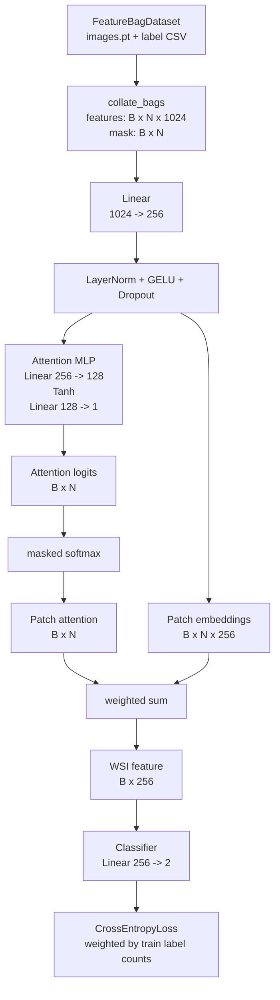
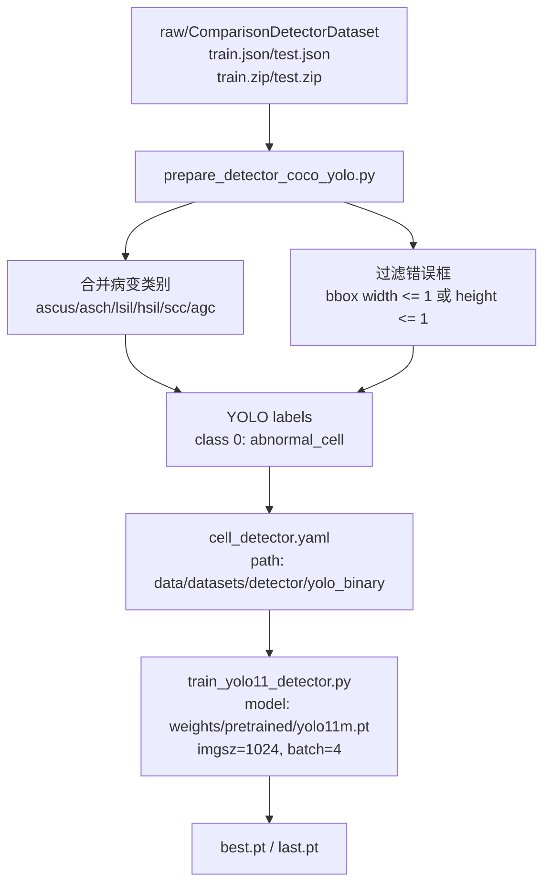
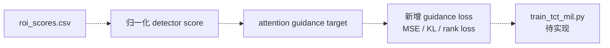

# 当前模型图

这张图按当前代码实现绘制。注意这里有两个尺寸：WSI 上裁出来代表一个 MIL patch 的区域是 `1024 x 1024`；送入 UniCAS ViT 前会 resize 到 `224 x 224`，因为当前 UniCAS 预训练权重对应 224 输入。

检测头已经能生成 `roi_scores.csv`，但 `train_tct_mil.py` 里还没有实现 attention guidance loss，所以检测分数回灌到 MIL 训练目前属于下一步。

## 已实现总流程

```mermaid
flowchart LR
    A["TCT WSI<br/>.svs BigTIFF"] --> B["tools/extract_tct_features.py<br/>TiffSlide 读取 WSI"]
    B --> C["均匀网格采样 MIL patch<br/>WSI crop: 1024 x 1024<br/>stride=1024, max_patches=512"]
    C --> D["Resize<br/>1024 x 1024 -> 224 x 224"]
    D --> E["UniCAS Encoder<br/>timm VisionTransformer<br/>weights/pretrained/UniCAS.pth<br/>frozen inference"]
    E --> F["Patch Features<br/>images.pt: N x 1024<br/>coords.csv: x/y/level/patch_size=1024/stride"]

    F --> G["train_tct_mil.py<br/>Attention-MIL"]
    G --> H["WSI 二分类 logits<br/>Normal / Abnormal"]
    G --> I["Patch Attention Scores<br/>B x N"]

    I --> J["tools/export_topk_rois.py<br/>Top-K ROI 坐标"]
    J --> K["ROI 图像<br/>1024 x 1024"]

    L["data/datasets/detector/yolo_binary<br/>ComparisonDetectorDataset -> YOLO binary"] --> M["train_yolo11_detector.py<br/>YOLO11m binary detector"]
    M --> N["Detector checkpoint<br/>runs/yolo11_cell_detector/.../weights/best.pt"]
    K --> O["tools/run_yolo11_roi_detector.py"]
    N --> O
    O --> P["roi_detections.csv<br/>bbox + confidence"]
    O --> Q["roi_scores.csv<br/>detector_score_max / sum / count"]
```



## Attention-MIL 代码结构

对应 [model/attention_mil.py](../model/attention_mil.py) 和 [train_tct_mil.py](../train_tct_mil.py)。



## 检测头训练代码结构

对应 [tools/prepare_detector_coco_yolo.py](../tools/prepare_detector_coco_yolo.py) 和 [train_yolo11_detector.py](../train_yolo11_detector.py)。



## 当前未实现但计划接入的引导



## 数据形状

```text
WSI MIL patch crop:      1024 x 1024
UniCAS encoder input:    [B, 3, 224, 224]
UniCAS ViT token patch:  16 x 16 on resized 224 input
UniCAS output feature:   [N, 1024]
Attention-MIL input:     [B, N, 1024]
Attention scores:        [B, N]
Top-K ROI:               1024 x 1024
YOLO11 detector input:   1024 x 1024 image
YOLO11 detector output:  abnormal_cell boxes + confidence
ROI guidance score:      detector_score_max / detector_score_sum / detector_count
```
